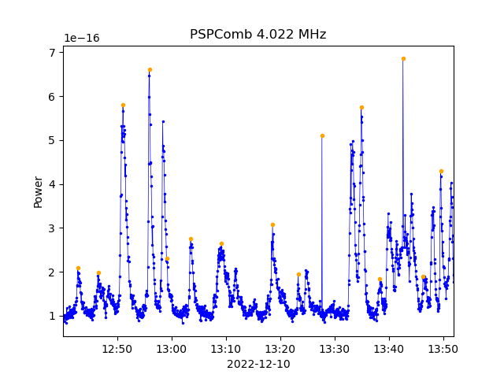
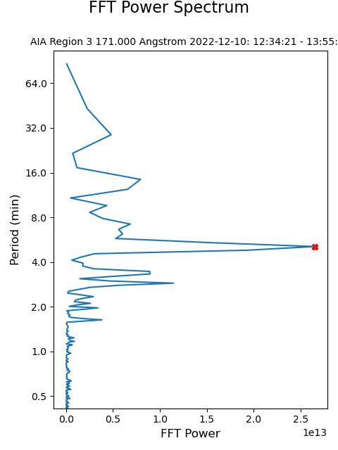
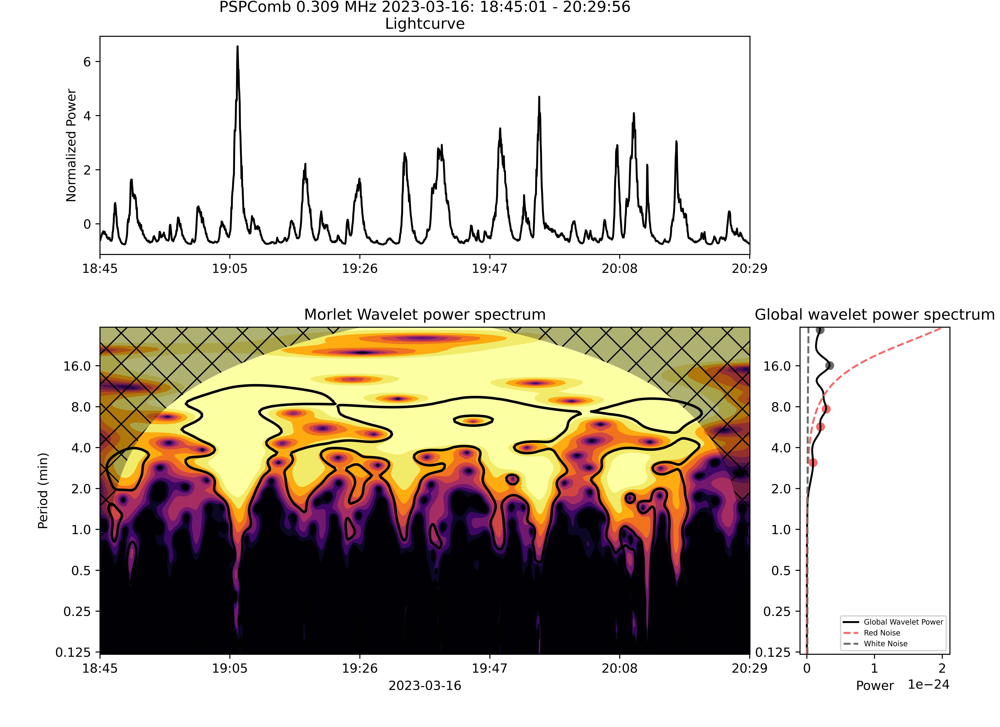

# NewPeriodicity

## Description

The purpose of this project is to determine if periodicities exist in radio, EUV, and x-ray intensity time series from several data sources (Parker Solar Probe, STEREO, WIND, AIA, and NuSTAR) during Type-III storms. This repository contains code used for data acquisition, periodicity analysis, and visual representation of results, as well as the results themselves, given as both .txt reports and .png plots.

## Usage

The program can be run from the command line. Simply run main.py, and you will be prompted to answer questions specifying the interval(s) you would like to analyze and the results you would like to produce. The following are helpful tips for optimally utilizing the program:

- Multiple time intervals that start on the same date can be given. You may analyze an interval that rolls over into the next day by adding 24 hours to the end time (i.e. an end time of 25:00 corresponds to 01:00 on the next day). All times are in UTC.
- For instruments whose data files are for entire days (PSP, WIND, STEREO), any time period during the day can be given. For AIA and NuSTAR, however, the start and end times given must correspond exactly to those in the filename for a certain interval.
- Multiple frequencies/wavelengths can be analyzed in one run. When multiple time intervals are given, all given frequencies/wavelengths will be analyzed for all given intervals, if possible. The same is true for regions, when applicable.
- When only one time interval is given, you are given the option to split that interval into two subintervals about a certain time during the interval. This is especially useful for avoiding unwanted features in AIA data.
- Results for a certain interval are saved to the "Results/YYYY.MM/DD/" directory, where they are separated into "plots" and "txt".

The following software specifications are necessary for the code to run properly:

- Python 3.10.6 or 3.10.8 (other versions may work, but these ones certainly do)
- All necessary Python packages
- NASA's [CDF distribution](https://cdf.gsfc.nasa.gov/html/sw_and_docs.html), with the "lib" folder placed within the "NewPeriodicity" directory.

## Methodology

### Data Acquisition

The souces of data for this project are as follows:

- PSP & STEREO: [https://cdaweb.gsfc.nasa.gov/index.html](https://cdaweb.gsfc.nasa.gov/index.html)
- WIND/WAVES: [https://cdpp-archive.cnes.fr/](https://cdpp-archive.cnes.fr/)
- SDO/AIA: [https://nso.virtualsolar.org/cgi/search](https://nso.virtualsolar.org/cgi/search)
- NuSTAR: [https://heasarc.gsfc.nasa.gov/cgi-bin//W3Browse/w3browse.pl](https://heasarc.gsfc.nasa.gov/cgi-bin//W3Browse/w3browse.pl)

All data must be stored in the corresponding folder within the ./DATA directory. Data for AIA and NuSTAR are saved to the remote repository. However the large cdfs or .dat files used by PSP, STEREO, and WIND, must be downloaded and stored locally.

### Periodicity Analysis

We utilize three different methods of periodicity analysis and compare their results. These methods are
- Peak Finder: Local maxima are identified in the time series by simple comparison to adjacent values. A period is then calculated from the mean spacing between local maxima.
- FFT: Methods from the scipy.fft library are used to preprocess (0-padding, mean subtraction, Hanning window) and subsequently calculate the Discrete Fourier Transform of a given time series. Periodicities are identified as peaks in the FFT power spectrum.
- Wavelet: Methods from the pycwt library are used to calculate the wavelet power spectrum of a given time series, usually with a Morlet wavelet. Estimates of the power spectra for white and red noise are also produced and used for significance testing.

### Visual Representation of Results

Each periodicity method produces a plot along with a text file. For the peak finder, a time series highlighting the peaks used to estimate the period is produced. The FFT method generates a plot of the power spectrum. The wavelet method produces a composite plot including the time series after normalization, the wavelet power spectrum, and the time-averaged ("global") power spectrum. 

Fig. 1: Time series representation of a LightCurve from PSP with peaks highlighted  
  

Fig. 2: FFT Power spectrum of a detrended LightCurve from AIA  
  

Fig. 3: Wavelet power spectrum plot for a LightCurve from PSP  
